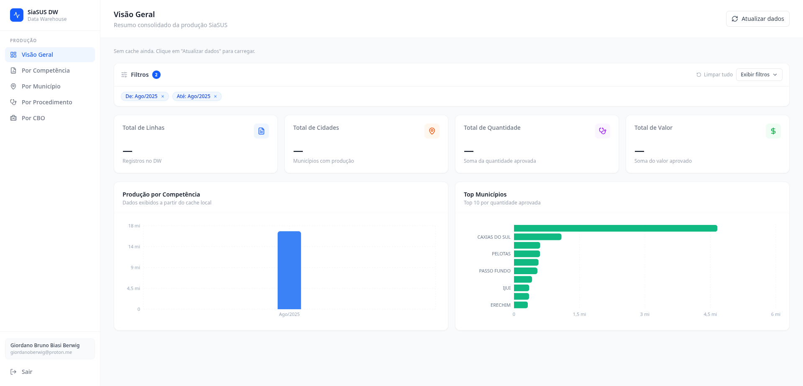
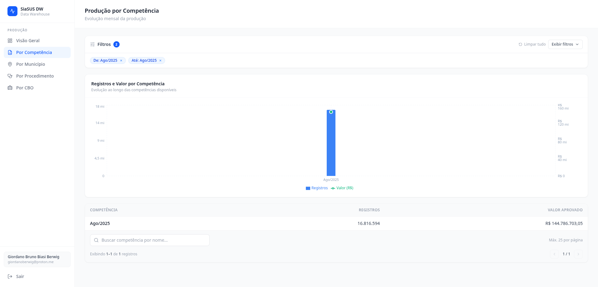
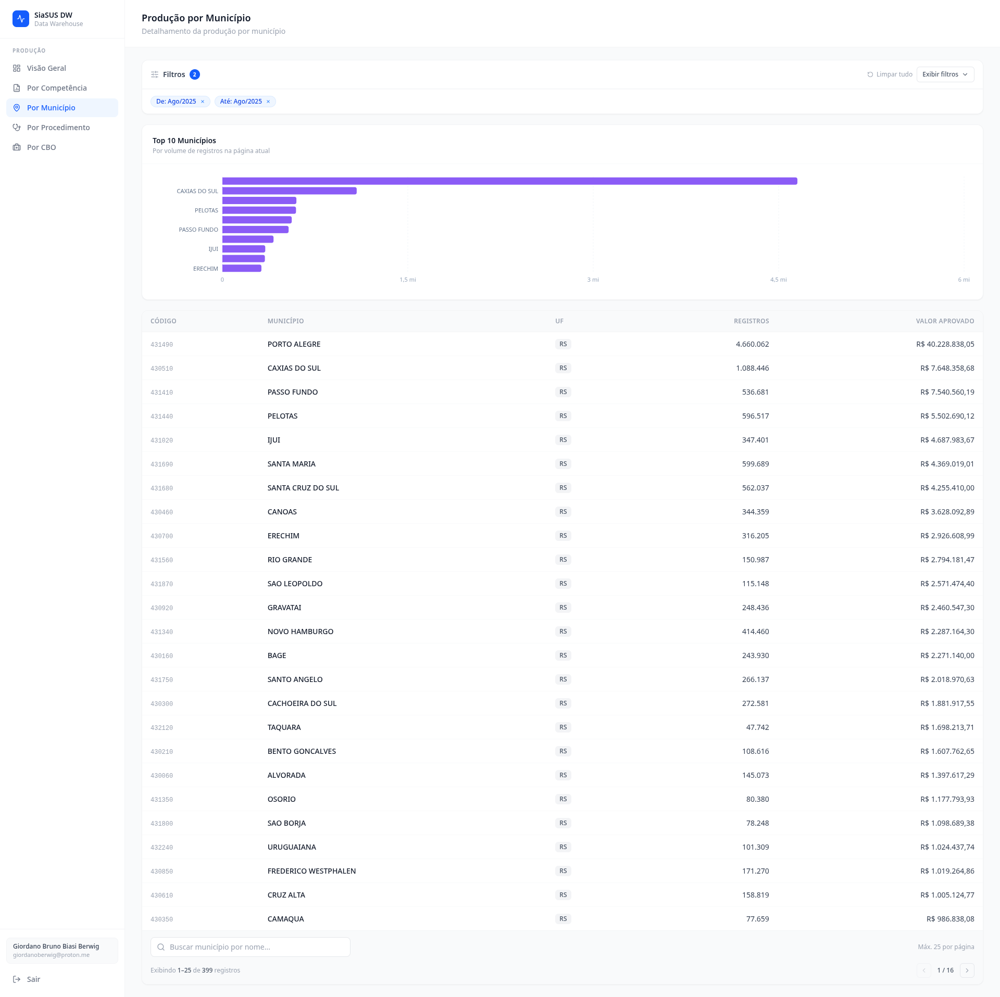
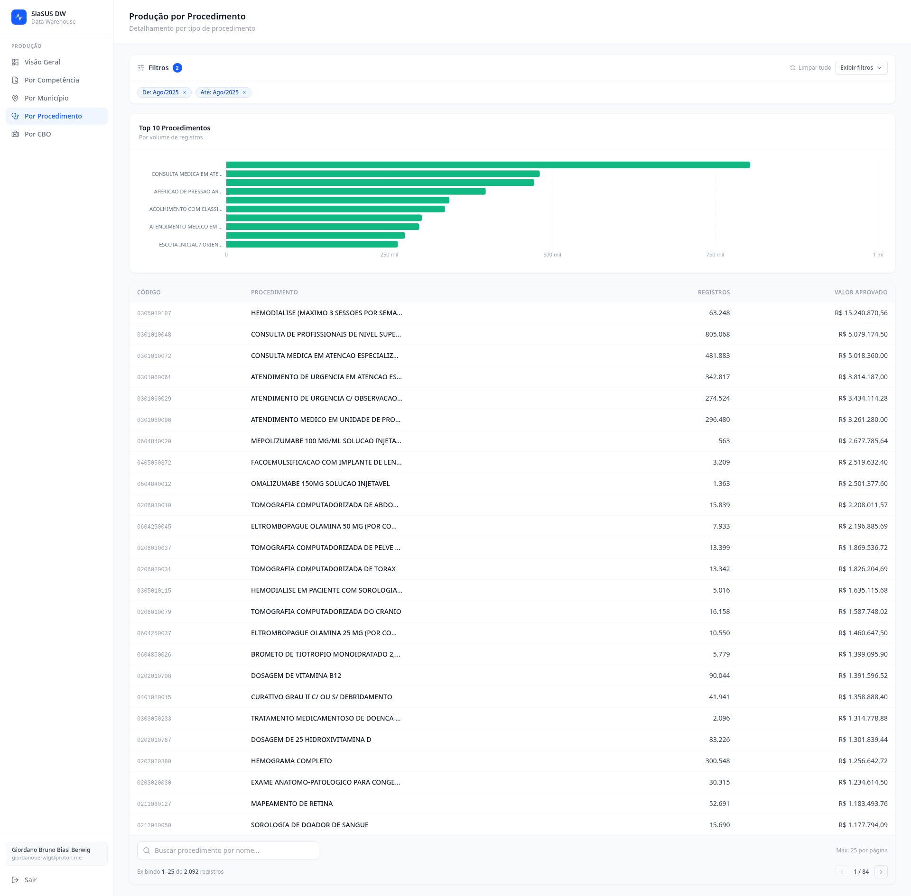
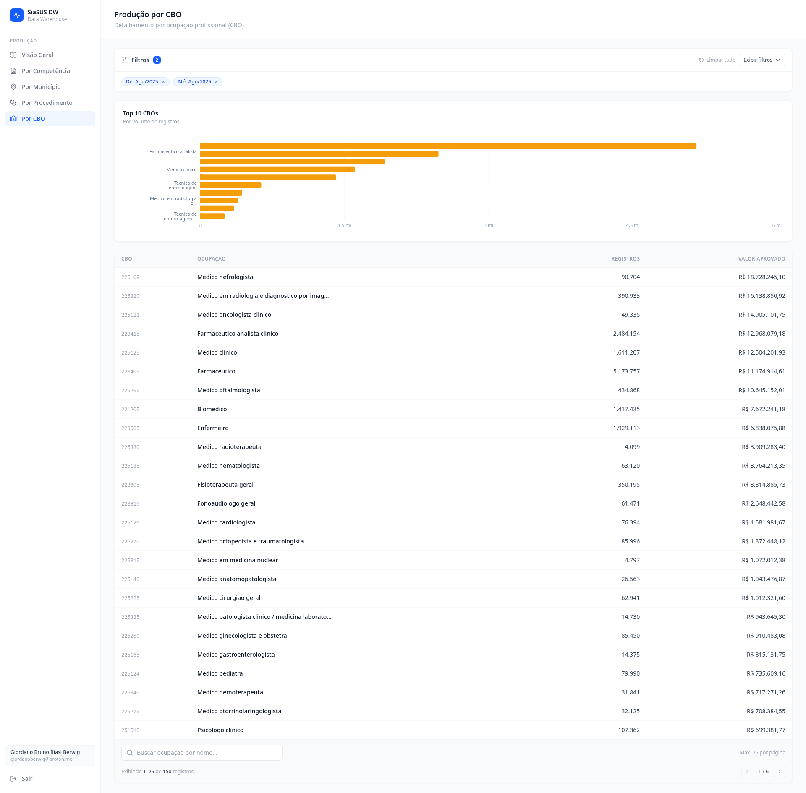

# f-siasus-dw

Frontend analytics dashboard for SIA/SUS data, built with React, TypeScript, and Vite.

The application provides authenticated access to healthcare production indicators with interactive charts, paginated tables, shared filters, and client-side caching for fast navigation.

## Table of Contents

- [Overview](#overview)
- [Screenshots](#screenshots)
- [Core Features](#core-features)
- [Tech Stack](#tech-stack)
- [Application Routes](#application-routes)
- [Getting Started](#getting-started)
- [Environment Variables](#environment-variables)
- [Available Scripts](#available-scripts)
- [API Endpoints Used by the Frontend](#api-endpoints-used-by-the-frontend)
- [Filtering, Search, and Pagination](#filtering-search-and-pagination)
- [Caching Strategy](#caching-strategy)
- [Project Structure](#project-structure)
- [Security Notes](#security-notes)
- [Troubleshooting](#troubleshooting)
- [License](#license)

## Overview

This project is the web client for a Data Warehouse API focused on SIA/SUS production data.

Main goals:

- Protect access through authentication and token validation.
- Provide a responsive dashboard with KPIs and charts.
- Enable exploration through global filters, table search, and pagination.
- Reduce unnecessary requests using browser-side cache.

## Screenshots

### 1) Overview Dashboard



### 2) Competency Analysis



### 3) Municipality Analysis



### 4) Procedure Analysis



### 5) CBO Analysis



## Core Features

- Authenticated workflow using API key + bearer token.
- Route protection for all dashboard modules.
- Shared filter state across pages (period, region, procedure, CBO, values, and more).
- Search by name in table-oriented views.
- Pagination with up to 25 items per page to keep tables compact.
- KPI cards and charts for quick visual analysis.
- Stale/cache-first behavior to improve perceived performance.

## Tech Stack

- React 19
- TypeScript 6
- Vite 8
- Tailwind CSS 4
- React Router DOM
- Axios
- Recharts
- ESLint

## Application Routes

- `/login`: Authentication page
- `/`: Overview dashboard with KPIs and top charts
- `/competencia`: Production by competency
- `/municipio`: Production by municipality
- `/procedimento`: Production by procedure
- `/cbo`: Production by occupation (CBO)

All routes except `/login` are protected.

## Getting Started

### Prerequisites

- Node.js 20+ (recommended)
- npm 10+
- Access to the backend API (or local proxy target)

### Installation

```bash
npm install
```

### Development

```bash
npm run dev
```

By default, Vite runs at `http://localhost:5173`.

### Production Build

```bash
npm run build
```

### Local Preview of Production Build

```bash
npm run preview
```

## Environment Variables

Create a `.env` file in the project root:

```env
VITE_API_URL=/api
VITE_API_KEY=your-api-key
```

Notes:

- `VITE_API_URL=/api` is intended for local development with the Vite proxy.
- `VITE_API_KEY` is sent in the `X-API-KEY` header for API requests.
- Environment files are ignored by Git.

## Available Scripts

- `npm run dev`: Start development server.
- `npm run build`: Type-check and build for production.
- `npm run preview`: Preview the production build.
- `npm run lint`: Run ESLint.

## API Endpoints Used by the Frontend

### Authentication

- `POST /api/login`
- `GET /api/me`
- `POST /api/logout`

### Production Data

- `GET /api/producao/resumo`
- `GET /api/producao/por-competencia`
- `GET /api/producao/por-municipio`
- `GET /api/producao/por-procedimento`
- `GET /api/producao/por-cbo`
- `GET /api/producao/competencias`

### Dimensions

- `GET /api/dim/filtros`
- `GET /api/dim/municipios`
- `GET /api/dim/ufs`
- `GET /api/dim/procedimentos`
- `GET /api/dim/cbos`
- `GET /api/dim/cnes`

## Filtering, Search, and Pagination

The global filter bar is driven by `/api/dim/filtros` and supports fields such as:

- `competencia_inicio`
- `competencia_fim`
- `ano`
- `uf`
- `codigo_mun`
- `cod_procedimento`
- `codigo_cbo`
- `cnes`
- `min_valor`
- `max_valor`
- `sem_custo`

Table pages also include:

- Name-based search input.
- Pagination controls.
- Maximum of 25 rows per page.

## Caching Strategy

The frontend applies a client-side cache strategy to reduce repeated requests and improve responsiveness.

Highlights:

- API responses are cached in `localStorage` using endpoint + params + auth context.
- Some pages use cache-first loading for instant rendering.
- Fresh requests are still performed to keep data updated.
- Summary and chart views can use stale-while-revalidate behavior.

## Project Structure

```text
src/
  components/
    layout/
    ui/
  contexts/
  pages/
  services/
  types/
  utils/
```

Quick responsibilities:

- `components`: Reusable UI and layout building blocks.
- `contexts`: Authentication and shared filter state.
- `pages`: Route-level screens.
- `services`: API client and mapping/caching logic.
- `types`: Shared TypeScript contracts.
- `utils`: Formatting and helper functions.

## Security Notes

- Access token is stored in `sessionStorage`.
- Cached analytical payloads are stored in `localStorage`.
- Unauthorized responses (`401`) clear auth state and redirect to login.
- Environment files are excluded from version control.

## Troubleshooting

### API requests fail in local development

- Confirm `VITE_API_URL=/api` in `.env`.
- Confirm backend is reachable at `https://localhost:8443` (default proxy target in Vite config).
- If using self-signed certificates, ensure local trust settings are correct.

### Empty charts or tables

- Verify credentials and token validity.
- Check active filters (they may be too restrictive).
- Use page refresh controls to force data update when needed.

### Lint or build issues

```bash
npm run lint
npm run build
```

## License

This project is licensed under the MIT License. See [LICENSE](LICENSE).
